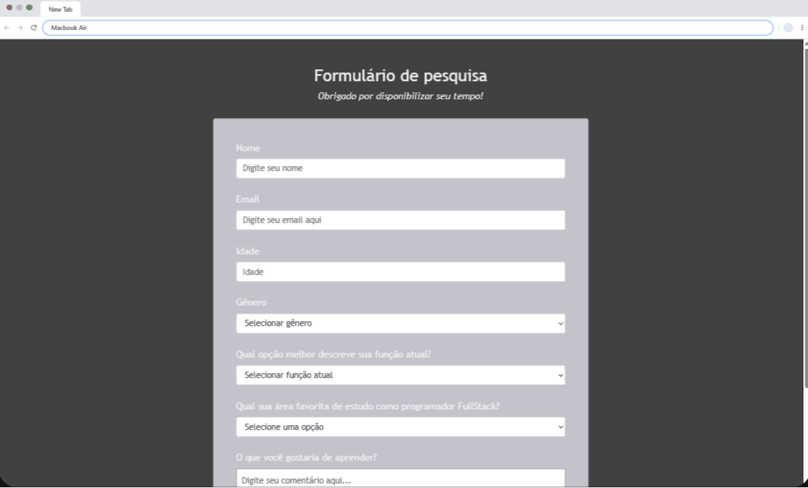

# Olá, eu sou a Andressa! 👋
## 🚀 Sobre mim
Eu sou uma pessoa desenvolvedora full-stack...

# Formulário de Pesquisa

A proposta para o desenvolvimento deste projeto foi a construção de um tela de login com direcionamento para um formulário de pesquisa com uma conexão simples com banco de dados. Utilizando dos recursos aprendidos durante as aulas do curso de programação FullStack com o professor Walace Oliveira.

## Funcionalidades

- Exibição da tela de login: a tela mostra o campos email e senha e funcionalidades específicas para uma tela de login.
- A tela de login direciona para um formuláario de pesquisa que possui uma conexão com o banco de dados.
- Personalização de estilo: a tela de login e formulário de pesquisa fora, personalizados com fontes, cores, tamanhos e formatos de exibição.

## Screenshot
<div align="center">
  <h3>Tela de Login</h3>
  
</div>
<div align="center">
  <h3>Formulário</h3>
  
</div>


## Tecnologias
<p>As seguintes ferramentas foram utilizadas na construção do projeto:</p>
<ul>
  <li><a href="https://www.php.net/" target="_blank">PHP</a></li>
  <li><a href="https://developer.mozilla.org/pt-BR/docs/Web/CSS" target="_blank">CSS3</a></li>
  <li><a href="https://developer.mozilla.org/pt-BR/docs/Web/HTML" target="_blank">HTML5</a></li>
  <li><a href="https://www.mysql.com/" target="_blank">MySQL</a></li>
  <li><a href="https://www.apachefriends.org/download.html" target="_blank">XAMPP</a></li>
</ul>

## Clonar o repositório

`git clone https://github.com/andressa-l/formulario-com-php.git`


## Aprendizados
- Neste projeto, eu aprendi sobre como criar um formulário interativo com integração entre frontend (HTML) e realizar a busca por informações em um banco de dados.
- Utilizei o XAMPP Control Panel para colocar para controle de dados - configuração de ambiente de desenvolvimento local para criar e testar sites dinamicos.
- Fiz um conexão simples com banco de dados MySQL.
- Filter animation - utilizei o filter para criar efeitos de animação.

```` css
@keyframes animateBg {
  100% {
    filter: hue-rotate(360deg);
 }
}
````

> Este código cria uma animação chamada `animateBg`, que altera a cor de fundo de um elemento. A palavra-chave `100%` significa que a animação será totalmente concluída. A propriedade `filter` é usada para aplicar o efeito de rotação de matiz. O valor `360deg` significa que a rotação será completada em 360 graus.

<em>Aqui consta as principais tecnologias usadas, podem ser abordadas outras no desenvolvimento do projeto, basta conferir o código completo. </em>


## Autores

- [@andressa-l](https://www.github.com/andressa-l)


<div align="center">Feito com 💜 por <a href="https://github.com/andressa-l">Andressa</a>.</div>
<br />